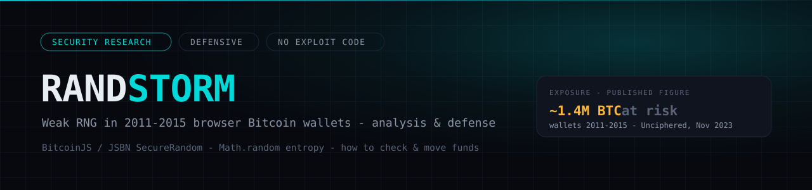

# Randstorm

A rigorous analysis of **Randstorm** — the family of weak random-number-generation
flaws in browser Bitcoin wallets built on **BitcoinJS** (via the **JSBN**
`SecureRandom()` routine) between **2011 and 2015**. The private keys of affected
wallets were drawn from generators whose true entropy was a tiny fraction of the
256 bits a Bitcoin key requires, collapsing the search space from astronomically
large to, in the worst cases, **searchable on a laptop**.

This repository works the problem out in full: the entropy mathematics, the
internal RNG of **every major browser engine of the era**, the exact seeding
path through JSBN, and the timeline of when a cryptographically secure source
became available in each browser.

> **What this is, and is not.** A **defensive, quantitative write-up**: the
> mathematics of *why* the keys are weak, the browser-engine history, how to
> protect wallets you own, and — new in chapter 9 — the **search economics**:
> what a keyspace sweep actually costs on modern hardware. It contains **no
> key-recovery code, no seed reconstruction procedure, and no keyspace
> enumerator.** It explains the size of the haystack; it does not hand anyone a
> machine for searching it. Recovering keys to wallets you do not own is theft.
> The parts of a working sweep that are deliberately **withheld** from this
> public material are itemised transparently in the
> [redaction ledger](docs/09-SEARCH-ECONOMICS.md#96-the-redaction-ledger).

---

## Abstract

A 256-bit ECDSA private key is secure only if it is drawn uniformly from
$2^{256}$ possibilities. Randstorm-era wallets did not do this. They filled key
material from JavaScript's `Math.random()` — a **non-cryptographic** PRNG — or
from a mis-wired fallback, because the intended secure source
(`window.crypto.getRandomValues`) was either absent in the browser or bypassed by
a code defect. The result is that the reachable key space is bounded not by the
256 bits of the key, but by the **internal state of the PRNG** (32–48 bits) and,
worse, by the **entropy of that PRNG's seed** (often a timestamp, 22–35 bits).
This document quantifies each bound, per browser, and shows how the exposure
gradient tracks the ecosystem's adoption of real CSPRNGs across 2011–2015.

**Headline exposure (Unciphered, Nov 2023): ~1.4 million BTC** sat in
potentially affected wallets.

---

## The one-line theorem

> The entropy of a generated key can never exceed the entropy of the process
> that generated it.

Formally, if a key is a deterministic function $k = f(s)$ of a generator seed/state
$s$ drawn from a set $S$, then the number of distinct keys is at most $|S|$, and
the effective key entropy is

$$H_{\text{eff}} = \min\bigl(256,\ \log_2 |S_{\text{state}}|,\ \log_2 |S_{\text{seed}}|\bigr)\ \text{bits.}$$

Every number in this report is an instance of that inequality. The full
derivation and worked bit-budgets are in
[docs/02-ENTROPY-MATH.md](docs/02-ENTROPY-MATH.md).

---

## What collapses the space (summary)

| Layer | Ideal | Randstorm reality | Ref |
|---|---|---|---|
| Key length | $2^{256}$ | unchanged (the key *looks* 256-bit) | — |
| PRNG internal state | n/a (CSPRNG) | **32 bits** (V8 MWC1616 distinct outputs) · **48 bits** (Firefox/IE LCG) · tiny (Safari GameRand) | [03](docs/03-BROWSER-RNG.md) |
| PRNG seed | n/a | often a **timestamp**: ~$2^{35}$ (year) → ~$2^{26}$ (day) → ~$2^{22}$ (hour) | [02](docs/02-ENTROPY-MATH.md) |
| Secure source available? | yes | **frequently no** before 2013 (see CSPRNG timeline) | [05](docs/05-CSPRNG-TIMELINE.md) |

The effective security is the **minimum** of those rows — which is why some
2011–2012 wallets have on the order of **$2^{25}$–$2^{35}$** real entropy instead
of $2^{256}$.

---

## Documentation

| Chapter | Contents |
|---|---|
| [01 — Cryptographic background](docs/01-BACKGROUND.md) | ECDSA keys, where entropy enters, min-entropy vs Shannon entropy |
| [02 — Entropy mathematics](docs/02-ENTROPY-MATH.md) | The ceiling theorem, seed/state bounds, timestamp bit-budgets, expected-work tables |
| [03 — Browser RNG internals](docs/03-BROWSER-RNG.md) | V8 MWC1616, SpiderMonkey LCG, JavaScriptCore GameRand, IE — algorithms, state sizes, switch dates |
| [04 — JSBN SecureRandom](docs/04-JSBN-SECURERANDOM.md) | The ARC4 pool, the intended seeding, and the defect that dropped it to `Math.random` |
| [05 — CSPRNG availability timeline](docs/05-CSPRNG-TIMELINE.md) | When `getRandomValues` shipped in each browser, and the 2011–2015 exposure gradient |
| [06 — Check & remediate](docs/06-CHECK-AND-REMEDIATE.md) | Are *your* wallets affected? How to check safely and move funds |
| [07 — For developers](docs/07-FOR-DEVELOPERS.md) | Correct key generation, fail-closed design, anti-patterns |
| [08 — References](docs/08-REFERENCES.md) | Primary sources and further reading |
| [09 — Search economics](docs/09-SEARCH-ECONOMICS.md) | What a sweep costs: per-candidate anatomy, measured GPU throughputs, the kangaroo fallacy, redaction ledger |

---

## Private reference implementation (licensing)

The research here is complete enough to audit; it is deliberately incomplete as
a capability. The **complete capability exists** — and it is not for sale to
the public.

> **Status: a 100% working, tested private implementation for Linux + NVIDIA
> CUDA exists.** It implements the full sweep end-to-end — validated against a
> live-browser capture, with multi-GPU scheduling, crash-safe checkpointing,
> and CPU-verified results — and has been **tested and confirmed working on
> real NVIDIA hardware** (RTX 3090 / 4090 class, multiple GPUs).

**It will not be released publicly.** It is available **only** to:

- **registered, verifiable companies** in the legitimate key-recovery /
  digital-asset-forensics business (registration documents and references
  required),
- with **serious computational resources** — the sweep genuinely needs them
  (see [chapter 9](docs/09-SEARCH-ECONOMICS.md)); a single gaming GPU is not a
  recovery platform,
- and only for use on addresses their clients are **authorised to recover**.

**Licensing starts at USD $50,000.** This is not a symbolic price: it filters
for organisations with a real engagement pipeline, covers the cost of the
hardware the tool demands, and reflects that the withheld components (§9.6)
are the product. Hobbyists, resellers, and "individual researchers" need not
inquire; there is no cheaper tier.

To open a licensing conversation: **open a GitHub issue in this repository**
marked `licensing` (initial contact stays on the record; substantive discussion
moves to private channels under NDA). Verified buyers receive the private
repository, deployment documentation, benchmark harnesses, and support.

---

## Funding

Independent security research, published so the people affected can protect
themselves.

`1Be6LLAEndprdWKiH6YM62setFQRXJzfha` — mainnet P2PKH. **Verify before sending:**
open an issue and ask me to confirm the address, and check the first and last
four characters (`1Be6` … `zfha`). Nothing here is an investment offer and no
return of any kind is implied.

---

## Disclaimer & scope

Defensive and educational. Documents a publicly-disclosed vulnerability using
public sources and first-principles cryptographic analysis. No code to recover
keys or enumerate the weak keyspace is included. Do not use this information to
access wallets you do not own.

## License

Written analysis under **CC BY 4.0** — see [LICENSE](LICENSE). Cite as:
*Solitech, "Randstorm: weak-RNG in 2011–2015 browser Bitcoin wallets," 2026.*
